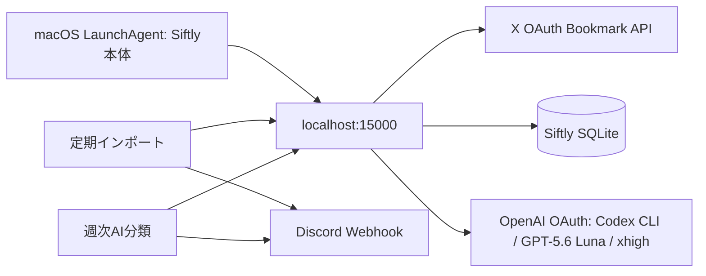

# Siftly 自動取り込み・週次AI分類 作業台帳

最終確認: 2026-09-27
この文書を、Siftlyの自動化作業で唯一の現行台帳として扱う。過去の設計案と食い違う場合は、この台帳の「現在の方針」と最新の作業記録を優先する。Lunaは一度に未完了IDを一つだけ実装し、完了条件を証拠付きで更新してから次へ進む。

初回は「現在の状態」と次のIDを読み、担当チケットに進む。Astraは計画・優先順位・台帳更新を担い、Lunaは指定された一つのコード作業を実装する。仕様選択が必要なら推測で埋めず、この台帳に論点と根拠を残してユーザーに尋ねる。

## 目的と現在の方針

- XのブックマークをSiftlyへ自動取得する。目安は3〜4日ごと。
- 保存済みの未分類ブックマークへ週1回AI分類をかけ、OpenAI OAuth経由のCodex CLIでGPT-5.6 Lunaを使う。分類要求のreasoning effortは`xhigh`。GPT-6 Lunaは現在のCodex CLI + ChatGPT OAuthでは拒否されるため使わない。
- 実行結果をDiscord Webhookへ送る。
- 分類エンジンは`llm`を維持する。Jevは任意実装として残っているが、既定値を変えない。10件比較では自動採用0件で、切り替えの根拠がない。
- X APIの利用枠に達した記録がある。枠が戻ったことを確認するまで、Xへの実データ取得を試さない。

### 処理の流れ



## 状態の読み方

| 状態 | 意味 |
|---|---|
| 完了 | 実装または設定があり、この台帳に記した方法で現在の状態を確認した |
| 実装済み・未運用確認 | コードとテストはあるが、実アカウントでの実行・配信を確認していない |
| 要実装 | コード、設定、または検証が不足している |
| 外部待ち | Xの利用枠など、プロジェクト外の条件が整うまで実データで確認できない |
| 保留 | 今は不要。再開条件を記したもの |

「前回テストが通った」は、その時点の記録であり、今回この台帳作成時に全テストを再実行したという意味ではない。

## 現在の状態

| 項目 | 状態 | 根拠 |
|---|---|---|
| Siftly本体の起動 | **完了（起動・自動復帰・画面表示確認）** | 専用`scripts/siftly-server.sh`を起動先にした。現在のLaunchAgentは`running`、PID 16713。Node PID 16768がTCP `*:15000`をlisten。2026-09-27にブラウザーで`http://localhost:15000/settings`を表示し、再読込後に設定読込中表示が消えることを確認。`localhost`・`127.0.0.1`・`::1`・`/api/settings`は最終確認でHTTP 200。初回の4秒curlはtimeoutし、同じ再試行はHTTP 200。2秒上限のIPv4連続20回では5回timeoutしたが、ブラウザーでの再現はなく、timeoutの原因は未確定。ユーザーLaunchAgent plistはGit管理外。 |
| X定期ジョブ | **設定済み・利用枠待ちで停止中** | 月曜・木曜10:00 JSTのplistを保持。2026-09-27に`launchctl disable`と`bootout`を実施し、`print-disabled`で`=> disabled`、未登録を確認。回復確認後に再登録する。 |
| 週次分類ジョブ | **設定・実起動確認完了** | 金曜10:00 JST。2026-09-27にLaunchAgentを`kickstart`し、対象0件で`runs = 1`、`last exit code = 0`を確認。自然な金曜の時刻到来は未確認。 |
| 自動ジョブの通知 | **Webhook受理・Discord表示・通知設定確認済み／端末配信は未確認** | 実ブックマーク1/1件の分類結果通知はHTTP 204。テスト投稿はDiscordの`#通知`に表示。2026-09-27の画面確認でチャンネルはミュートされず「全メッセージ」（カテゴリー既定）、macOSのDiscord通知許可もon（デスクトップ/通知センター/ロック画面有効）。今回の追加テストもWebhook HTTP 204で受理。実際のOSバナーまたはモバイル端末で受信した瞬間は観測できていない。X取得結果通知はQA-03待ち。 |
| X API | **外部待ち** | 過去に403 `spend-cap-reached`。開発者ポータルはログイン要求となり、現在の利用枠を確認できなかった。回復をユーザーへ確認中。X APIは呼んでいない。 |
| AI分類 | **実ブックマーク1件の分類・保存確認完了** | OpenAI CLI OAuth / `gpt-5.6-luna`、要求設定`xhigh`、既定`llm`。通常分類APIの選択ID経路で1件を分類・保存。既存カテゴリ・本文等を維持。CLIはread-only・一時セッションを明示する。 |
| Git | **originと同期済み** | 2026-09-27に`codex/obsidian-auto-archive`のHEADとupstreamが一致し、作業ツリーcleanを確認。本追記を含む最新コミットもoriginへpush済み。ユーザーLaunchAgent設定はGit管理外。 |

## Phase 0 — 実装前に再利用する契約

### 2026-09-27の再開順序

ユーザーがSolへの切り替えを明示して再開。Solが単独で次の順に検証・記録する。承認済みの自動化と台帳の範囲内で進める。

1. SCH-01: 本体の汎用node直接起動をSiftly専用ラッパーへ変更。分類・archive処理が停止中と確認して対象LaunchAgentだけ再読込し、HTTP 200と終了後のKeepAlive復帰を検証する。
2. QA-02: CLIを明示的なread-only・一時セッションで起動するよう既存ヘルパーを修正。6,017件すべて分類済みのため、手動修正・メディア・未完了タグがない既存1件を通常分類の選択ID経路で検証する。既存カテゴリを削除せず、本文やIDを検証ログへ出さない。
3. QA-03: ログイン済みの開発者画面で利用枠の回復を確認できるか調べる。回復が不明な間はX APIを呼ばず、実取得ゲートを未完了として残す。

主なリスクは本体再起動中の短い停止と、1件の分類結果更新。対象ジョブの停止状態、保存数、秘密値を含まない通知、回帰テストを証拠にする。

未完了チケットへ着手するLunaは、対象ファイルとそのテストを読み直す。下記は2026-09-26のコード確認で得た入口であり、実装前に現在のHEADと照合する。

### 使える既存API

- **X OAuth取り込み**: `POST /api/import/x-oauth/fetch`（`app/api/import/x-oauth/fetch/route.ts`）。入力に`maxPages`（1〜10）、`nextToken`、`includeThreads`、定期実行専用の`scheduled`がある。応答には`complete`、`hasMore`、安全な`warnings`を加えた。定期実行のカーソルはSQLite `Setting`の`x_oauth_scheduled_import_next_token`へページごとに保存する。
- **分類開始**: `POST /api/categorize`（`app/api/categorize/route.ts:109`）。通常は`{ force: false, language: 'ja' }`を送る。成功時は`{ status: 'started', total, runId }`を返す。
- **分類状態**: `GET /api/categorize`（同ファイル:77–88）。`status, runId, stage, done, total, stageCounts, lastError, error`を返す。`DELETE`は実行中の停止要求（同ファイル:91–103）。ジョブの監視は`runId`が開始時と同じであることを確認する。
- **通常分類の対象**: `POST /api/categorize`に`force:false`を渡す。現在は`enrichedAt`が未設定かつゴミ箱でないBookmarkを対象にする（同ファイル:258–265）。手動フィードバックを保護しながら保存する。
- **分類エンジン**: `getCategoryEngine()`（`lib/categorizer.ts:161–171`）。環境変数未設定時の既定値は`llm`。
- **分類結果保存**: `writeCategoryResults(results, options?)`（同ファイル:556–629）は保存されたBookmark IDの配列を返す。分類数はAI応答数ではなく、この保存結果を基準にする。
- **Codex CLI**: `codexPrompt(prompt, { model, reasoningEffort, timeoutMs })`（`lib/codex-cli.ts`）。`CODEX_CLI_PATH`を優先する。`--ignore-user-config --skip-git-repo-check --sandbox read-only --ephemeral`を明示し、アプリ側のモデル・推論設定を渡す。GPT-5.6 Lunaと`xhigh`の要求は`__tests__/categorizer-partial-response.test.ts`、CLI権限は`__tests__/codex-cli.test.ts`で検証する。
- **既存定期実行**: `scripts/siftly-scheduled-task.sh`がHTTP経由で取り込み・分類APIを呼び、分類は最大6時間ポーリングする。Webhook送信関数も同ファイル内にある。

### 避けること

- 別のX取得経路（Cookie/内部GraphQL）へ自動処理を切り替えない。希望しているのはSiftlyのX OAuthライブインポート。
- OpenAI OAuthをOpenAI SDKのAPIキーとして扱わない。OAuthは`codex exec`経由。
- X APIの403を一律に「月間上限」と推測しない。Xの応答に明示されたエラーだけ分類する。429と利用枠超過も混同しない。
- 既存の正常分類結果を、同じバッチの一部欠落だけを理由に破棄しない。欠落分の小分け再試行と部分結果保存は既に入っている。
- 通知失敗を理由にX取得やAI分類そのものをやり直さない。処理結果と通知の成否を分ける。
- `.env`、Webhook、OAuthトークン、ブックマーク本文をログやDiscordへ出さない。
- `start.sh`をLaunchAgentの起動先にしない。同スクリプトは依存導入、DBセットアップ、トンネル・ブラウザー操作も行う。専用`scripts/siftly-server.sh`からNext.jsだけを起動する。

## Lunaが進める実装台帳

各IDを一度に一つだけ実装する。完了したら、変更ファイル、実行したコマンドと結果、残る制約、コミットをこの表へ記録する。テストではX・Codex・Discordの外部通信をモックし、実アカウントに接続しない。

### IMP-01 — X取り込みの部分失敗を成功と誤認しない

**状態: 完了（API契約・モック検証）。** 不正JSONは400。正常終端、ページ上限、途中のHTTP/通信/応答形式失敗を`complete`・`hasMore`・`warnings`で区別する。途中失敗はそのページのtokenを返し、成功済み件数を保持する。403はX応答に`spend-cap-reached`が明示された場合だけ`quota_exceeded`とする。空ページにtokenがあれば続行し、循環tokenでは現ページを保存してから停止する。

**変更範囲:** 取り込みrouteと`__tests__/x-oauth-fetch.test.ts`。HTTP/JSONの契約だけを最小限に直し、新しい汎用ジョブ基盤は追加しない。

**実装:**

1. 不正JSONは400にする。
2. 正常終端、ページ上限、途中失敗、認証失効を呼び出し側が区別できるようにする。既存の件数フィールドを維持し、必要なら`complete`と機械判定可能な`warnings`を追加する。
3. 途中失敗時は保存済み件数を返し、**失敗したページを再試行できるカーソル**を返す。HTTP 200だけで完全成功と判定させない。
4. `quota_exceeded`はX応答に明示があるときだけ返す。`Retry-After`は有効な数値等を解釈できた場合だけ時刻へ変換する。
5. 空データ＋`next_token`、無効応答、同一トークン再出現を正常終端と区別する。無限ループは止める。

**受け入れ条件:** 最初のページ429、1ページ保存後の2ページ目429、通信例外、正常な空終端、空ページ＋次トークン、トークン循環がそれぞれ別の結果になる。途中失敗は先に保存した件数を保持し、完了扱いにならない。JSON構文エラーのテストは400を確認する。既存の11ページ取得テストを維持する。

**実装記録:** 2026-09-26、Codex。`app/api/import/x-oauth/fetch/route.ts`、`__tests__/x-oauth-fetch.test.ts`を変更。`npx vitest run __tests__/x-oauth-fetch.test.ts` — 27 tests passed。`npx tsc --noEmit` — pass。対象ESLint — pass。実X通信なし。コミット: `97b2613`。

### IMP-02 — Xページングをプロセス再起動後も再開する

**状態: 完了（モック検証）。** 定期実行は既存SQLite `Setting`の`x_oauth_scheduled_import_next_token`を読み、ページ保存後に次tokenを記録する。最終ページでは空値にし、次回は先頭から開始する。失敗ページのtokenは直前の成功ページ保存時に記録済み。APIが保存tokenを無効と明示した場合はtokenを消し、次回の先頭再開を警告する。1回の起動は最大10ページ。

**変更範囲:** 既存routeとスケジューラーshell、既存テスト。状態は、既存SQLite/Settingを再利用するなど、コードベースの保存方式を確認してから一番小さい安全な場所へ置く。X OAuth token自体を新しい場所へ複製しない。

**実装:** 1回の起動で処理するページ数に上限を設け、ページごとの成功後にカーソルを保存する。部分失敗・プロセス停止後は失敗ページから再開する。最終ページまで完了したらカーソルを消し、次の定期実行は先頭から始める。再取得時の重複は`tweetId`で防ぐ。Xのページtokenが無効になった場合に、古いtokenでループせず新しい走査へ戻る条件を定義する。

**受け入れ条件:** 11ページ以上、プロセス停止と再起動、同じページの再試行、token失効、最終ページ後の新規走査をモックテストで確認。既存の重複回避を保ち、1回の起動で無制限にXを呼ばない。API quota中に実Xで試さない。

**実装記録:** 2026-09-26、Codex。既存`Setting`のみを再利用し、スキーマ変更なし。`scripts/siftly-scheduled-task.sh`は`scheduled:true`でrouteを呼ぶ。X API通信・ページtoken再開・token失効はすべてmock。`npx vitest run __tests__/x-oauth-fetch.test.ts` — 32 tests passed。`npx tsc --noEmit`、対象ESLint、`bash -n scripts/siftly-scheduled-task.sh` — pass。コミット: `797ac7e`。

### IMP-03 — 自動取り込みでゴミ箱のBookmarkを復元しない

**状態: 完了（モック検証）。** `scheduled:true`の場合、既存行に`deletedAt`があれば取り込み件数の`skipped`へ数えるだけで、復元・archive enqueue・thread処理をしない。手動要求はこれまでどおり復元する。

**変更範囲:** 同じrouteと`__tests__/x-oauth-fetch.test.ts`。手動UIの現行動作との互換性を確認してから、呼び出しモードを明示する。Cookie同期や別の取得経路へ変更しない。

**受け入れ条件:** 自動モードの再取り込みでは`deletedAt`を保持し、同項目をarchive/thread処理へ再投入しない。既存の手動操作については既存仕様を保つか、明示された新仕様に合わせる。両モードのテストを置く。

**実装記録:** 2026-09-26、Codex。`app/api/import/x-oauth/fetch/route.ts`と`__tests__/x-oauth-fetch.test.ts`を変更。`npx vitest run __tests__/x-oauth-fetch.test.ts` — 34 tests passed。`npx tsc --noEmit`、対象ESLint — pass。ローカルDBへの実データ変更なし。コミット: `b792162`。

### CAT-01 — 停止要求後にLLMの追加要求を送らない

**状態: 完了（ユニットテスト）。** `shouldAbort`をLLM経路まで伝播し、起動前・初回応答後・各retry前・SDK fallback前に確認する。すでに動作中のCLI要求は強制終了せず、既存timeoutまで待つ。その応答内の有効結果は保持し、以後の要求を送らない。

**変更範囲:** `lib/categorizer.ts`、必要な場合だけ`app/api/categorize/route.ts`、既存分類テスト。

**実装:** 新しいCLIプロセスを起動する前に停止フラグを確認する。進行中の要求は既存timeoutを尊重し、応答済みの有効結果は保持する。停止後に再試行バッチを起動しない。停止状態で返った結果を保存するかどうかは、データを失わない挙動を選びテストで固定する。

**受け入れ条件:** 最初のLLM要求中に停止を入れたテストで、追加retry/fallback要求が送られない。有効な既着結果を誤って破棄しない。通常時の5件以下の欠落retryと`xhigh`を維持する。

**実装記録:** 2026-09-26、Codex。`lib/categorizer.ts`、`__tests__/categorizer-partial-response.test.ts`を変更。停止済み・初回応答中の停止・retry中の停止を検証。`npx vitest run __tests__/categorizer-partial-response.test.ts` — 4 tests passed。`npx tsc --noEmit`、対象ESLint — pass。外部LLM通信なし。コミット: `249d303`。QA-02の実CLIエラーでprompt引数がログ出力され得ると判明したため、Codex CLI失敗を定型化してprompt/feedbackを出さない回帰テストを追加（後続記録参照）。

### CAT-02 — 週次分類の件数と終了状態を保存結果にそろえる

**状態: 完了（route + fake HTTP検証）。** 両分類経路の終了時`done`は進捗stateを維持し、全件数へ水増ししない。`categorized`は保存済みBookmark ID数。0件、成功、一部未分類、停止、有効結果保存、処理開始前エラーに加え、定期shellがpoll時の`runId`変更を検知して停止することをmock HTTPで確認した。

**変更範囲:** まずrouteと既存テストを読み、再現する不整合がある場合だけ修正する。観測のために新しいDBモデルや実行履歴基盤を先回りして作らない。

**受け入れ条件:** 0件・全件成功・一部失敗・停止・別runIdへの切り替わりをモックテストで確認。`done`は処理済み数、`categorized`は実際に保存されたBookmark数として混同しない。既存件数をスケジューラーが正しく読める。

**実装記録:** 2026-09-26、Codex。`app/api/categorize/route.ts`、`__tests__/selected-category-apply.test.ts`を変更。`npx vitest run __tests__/selected-category-apply.test.ts` — 20 tests passed。`npx tsc --noEmit`、対象ESLint — pass。0件/正常/一部保存/停止/処理開始前・pipeline開始時のエラーを検証。`__tests__/siftly-scheduled-task.test.ts`でrunId切替も確認。コミット: `ecc9673`。

### NOT-01 — Discordへ部分成功・失敗を正しく伝える

**状態: 完了（fake HTTP・分類結果の実Webhook受理）。** Discordには新規/既存/処理件数、完了/部分/失敗、定型化した警告コードだけを送る。X cursor、upstream detail、LLM error detailのレスポンス全文は送らない。Webhook失敗は検知して非0終了し、元の取得・分類要求を再実行しない。macOS bash 3.2互換で未設定認証配列を避ける。2026-09-27、実分類1/1件の要約を実WebhookがHTTP 204で受理した。X結果の実配信はQA-03待ち。

**変更範囲:** `scripts/siftly-scheduled-task.sh`と必要なshellテスト。IMP-01/02の応答契約に合わせて更新する。Webhook URL、token、生の投稿本文を通知に含めない。

**実装:** 完了・一部完了・利用枠/認証待ち・失敗を区別し、新規件数/既存件数/継続有無/安全なエラー要約を送る。継続中を完了と通知しない。空振り時に何を通知するかは「実行結果をDiscordへ」という依頼に沿い、少なくとも定期実行結果を分かる形で送る。通知に失敗しても元のimport/classifyを再実行しない。

**受け入れ条件:** shell構文検査とfake HTTP serverによる成功・部分成功・HTTP失敗・Webhook失敗の確認。Webhook失敗が検知され、X/分類APIが二重実行されない。通知本文に秘密値がない。実Webhook受信確認はQA-02で別に記録する。

**実装記録:** 2026-09-26、Codex。`scripts/siftly-scheduled-task.sh`と`__tests__/siftly-scheduled-task.test.ts`を追加/変更。fake HTTPでimport完了・部分quota・HTTP失敗、分類0件/全件/部分/停止/timeout/runId変更、両処理のWebhook障害を検証。通知にcursor/raw detailが含まれず、処理APIは各1回だけ。最新`npx vitest run __tests__/siftly-scheduled-task.test.ts` — 7 tests passed。`npx tsc --noEmit`、`bash -n scripts/siftly-scheduled-task.sh` — pass。実装コミット: `affc333`、fake HTTP追加: `8cf0517`。

### SCH-01 — 3〜4日ごとの取得と週次分類をスリープ後も実行する

**状態: 本体復帰・分類ジョブ起動確認済み、X再開は外部待ち。** 月曜・木曜10:00 JSTの取得設定を保持し、回復確認までXジョブだけ無効・未登録にした。金曜10:00 JSTの分類ジョブは実際に起動して正常終了。`StartCalendarInterval`のスリープ後の繰り越しはman pageで確認したが、この検証ではMacを実際にスリープさせていない。

**変更範囲:** 2つのユーザーLaunchAgent plistと、必要な場合だけ既存shell。汎用scheduler/daemonは追加しない。

**設定:** `StartCalendarInterval`でX取得を週2回（月曜・木曜、3日/4日の間隔）、分類を週1回（金曜）に設定。時刻はJST 10:00。木曜取得の翌日に分類するため、分類前に定期取得を行い、週末前に分類を終える。macOSがsleepを終えた後にcalendarイベントをまとめて実行する性質を使う。ジョブはユーザーがログイン中のLaunchAgentとして動かす。

**受け入れ条件:** plistが辞書形式で`Label`、絶対パスの`ProgramArguments`、`WorkingDirectory`、ログ先を持つ。`plutil -lint`と`launchctl print`で2つの間隔/曜日、タイムゾーン前提、実行状態を確認する。設定反映のためbootstrapし直す前に、該当ジョブが処理中でないことを確認する。quota中にimportをkickstartしない。Siftly本体は今回修復済みの`com.moemic.siftly`を呼び出し先にする。

**実装記録:** 2026-09-26、Codex。`~/Library/LaunchAgents/com.moemic.siftly.live-import.plist`と`com.moemic.siftly.ai-categorize.plist`をローカル変更（Git外）。各`plutil -lint` — OK。`launchctl bootout/bootstrap gui/501`成功。`launchctl print`でcalendar triggers（Mon/Thu 10:00、Fri 10:00）、active count 0、`runs = 0`を確認。X・分類ジョブをkickstartせず。man pageによりsleep復帰後のcalendar trigger coalescingを確認。コミット対象外（ローカルのみ）。

**追加検証:** 2026-09-27、Sol。本体の起動先を新規`scripts/siftly-server.sh`へ変更。分類idle・archive処理0件を確認して本体だけ再登録し、`SIGTERM`後のKeepAlive復帰（PID14729→16713、runs2、HTTP 200）を確認。3つのplist構文検査と`sh -n scripts/siftly-server.sh`は成功。分類LaunchAgentを1回起動し、runs1・終了コード0。Xはkickstartせず、無効化と登録解除のみ実施。Git外のplistも新規Macへ自動移行するものではない。

### QA-01 — ローカル環境だけで3種類の結果経路を確認する

**状態: 完了（fake HTTPのみ）。** 新規の`__tests__/siftly-scheduled-task.test.ts`は127.0.0.1のfake serverと一時Webhook URLだけを使う。実X/Discord/OpenAI接続やBookmark DB書き込みはしていない。

**受け入れ条件:**

1. import正常完了、部分成功、403/429失敗で通知結果が異なる。
2. 分類0件、完了、一部未分類、停止、6時間timeoutを区別する。
3. `runId`が変わった場合に別ジョブの完了と誤認しない。
4. Webhook障害時にX取得や分類を再実行しない。
5. fake server以外へ接続せず、DBの実ブックマークを変更しない。

**実装記録:** 2026-09-26、Codex。分類timeoutをテスト時だけ即時化できる`SIFTLY_CATEGORIZE_TIMEOUT_SECONDS`（通常の既定は6時間）を用いてtimeout通知を検証。`npx vitest run` — 30 files / 255 tests passed。`npx tsc --noEmit` — pass。対象ESLintはエラーなし（既存warning 2件）、`bash -n scripts/siftly-scheduled-task.sh`、`git diff --check` — pass。fake HTTP外への接続なし。実装コミット: `8cf0517`。

**最新回帰検証:** 2026-09-27、`npx vitest run` — 30 files / 256 tests passed。`npx tsc --noEmit`、対象ESLint、shell・plist構文検査も成功。CLIのread-only・ephemeral起動を検証するテストを追加。QA-01のテストは外部通信・実Bookmark書き込みなし。実データ検証はQA-02に分けて記録した。

同日の現HEADに対する追加差分を単独レビューした。運用ルールとの不整合は追加差分に見つからず、仕様上の未完了はX実取得と取得ジョブの再開（QA-03/SCH-01）。専用ラッパーはこのMacの絶対パスとLaunchAgentのPATHを前提とする。自動インストーラー・別scheduler・追加依存は作っていない。日本語文書はquick検査を行い、台帳の定型見出しと用語反復はID別に探しやすくするため維持した。再現用ガイドも指定のObsidianフォルダーへ保存済み。

### QA-02 — OAuth分類とDiscordの実運用を一度だけ確認する

**状態: 完了（実ブックマーク1件・実Webhook受理）。** GPT-6 Lunaは現在のCLI + ChatGPT OAuthで拒否されたため、ユーザー希望のGPT-5.6 Lunaを選択。provider=`openai`、auth=`cli`、model=`gpt-5.6-luna`を設定APIで確認し、分類コードが`xhigh`をCLIへ渡すことをテストで確認。通常分類APIで既存1件を処理・保存し、Discord Webhookが結果をHTTP 204で受理した。実行中のCLI argvからモデルを観測したという意味ではない。CLI失敗時のprompt漏えい防止は`45341ec`で修正済み。

**条件と手順:** QA-01完了後に実施する。最初に`/api/settings/cli-status`でCLIが利用可能と分かる範囲を確認する。小さい分類対象で通常分類を1回実行し、モデル・推論強度、保存数、run状態をログ/応答から確認する。次にDiscordへ結果が届いたことを確認する。秘密値・Bookmark本文をログに転記しない。X APIはこのQAで呼ばない。

**受け入れ条件:** Codex CLIの利用可能性、GPT-5.6 Lunaと`xhigh`、実ブックマーク分類状態、Discord Webhook受理を個別に記録。どれか一つでも未確認なら全体を「完了」にしない。

**最新の確認記録:** 2026-09-27、Sol。`/settings`・`/api/settings`はHTTP 200、`/api/settings/cli-status`はCLI利用可能・認証情報あり。非削除6,017件、通常の未処理・未分類0件、archive処理0件。手動カテゴリ修正がなく、タグが揃い、メディアのない既存1件を選び、`POST /api/categorize`へ`{ bookmarkIds: [対象ID], force: false, language: "ja" }`を送った。categoryOnlyや全件forceは使っていない。runId=`muisib9e-1`、終了idle、done1/total1、categorized1、vision0、enriched0。既存カテゴリがすべて残り、本文・タグ・entitiesも変わっていないことをDBで確認した。カテゴリの保存は実データへの書き込みであり、単なる合成smokeではない。本文・ID・秘密値は検証ログへ出していない。

分類後、安全な件数と設定名だけの要約を`.env`の実Webhookへ1回送信し、HTTP 204を確認。その後、実際の分類LaunchAgentを1回kickstartし、通常の対象0件で終了コード0を確認した。新規未処理投稿の大量分類、自然な金曜の実行、Discord端末でのプッシュ表示はこの検証の対象外。共有CLIヘルパーはread-only・ephemeralを明示し、既存の検索・カテゴリ提案・画像分析の呼び出し元も確認した。

**2026-09-27 Discord通知の追確認:** 未pushだった12コミットを`origin/codex/obsidian-auto-archive`へpushし、`91d183a`まで反映した。設定済みWebhookへ個人情報・メンションなしのテストを1回送信し、HTTP 200で作成されたメッセージがDiscordの`#通知`に表示されることを確認。チャンネル通知は「カテゴリーのデフォルト設定を使用する: すべてのメッセージ」。macOSのDiscord通知許可はonで、デスクトップ・通知センター・ロック画面が有効、バナーは一時的。したがって現在のMac設定上は通常メッセージが通知対象であり、コードへのユーザーメンション追加は不要。実際のOSバナーが表示された瞬間、およびモバイル端末への配信は観測できていないため、物理端末までの受信は未確認として扱う。Webhook受理とチャンネル表示を端末プッシュの証拠に読み替えない。

**2026-09-27 最終追確認:** Discordデスクトップを開き、`#通知`に前記テストと実分類通知が残っていること、チャンネル通知が「すべてのメッセージ」（カテゴリー既定）でミュートされていないことを再確認。ユーザーの「これを解消して」を受け、メンションなしの新しい確認投稿をWebhookへ1件送り、HTTP 204で受理された。Webhook受理はDiscord側での表示・端末配信の証明ではない。今回の新投稿はチャンネル上で未再確認で、実際のOSバナーおよびユーザーのスマートフォンでの受信はこの環境から観測できないため、最後は端末側で受信確認待ち。Siftlyはブラウザーで`/settings`を表示し、curlのproxy経由timeoutはサーバー障害ではないと確認。Gitはこの追記後に更新する。

**2026-09-27 実機通知の接続確認:** `phone-harness --doctor ios`は、Quartz/Vision/AppKit・Accessibility・Screen Recording・iPhone Mirroringのインストール/起動はpass、「mirroring window found」だけfailし、手動でiPhone Mirroringを開いてペアリングするよう案内。画面取得はこのfail以前のVision初期化エラーで終わった。iPhone上の設定変更や操作はしていない。ユーザーがiPhone Mirroringを開き、iPhoneをペアリング/ロックして接続したと確認後、一度だけ再検証する。

**2026-09-27 Siftly再確認:** `launchctl print`で本体`running`（PID 16713）、`lsof`でNext.js子プロセスPID 16768が15000番をlisten。`/settings`はlocalhostで1.22秒、IPv6で0.29秒、`/api/settings`は0.05秒でHTTP 200。可視ブラウザーで再読込後も設定画面が表示され、5秒後に読込中表示が消えた。最初の4秒curlはtimeout、その同条件の再試行は成功。`--max-time 2`のIPv4 GETを20回行うと5回HTTP 000になったため断続的な遅延は記録するが、ユーザーのブラウザー障害を再現したとは扱わず、原因を推測してコード変更しない。ログには以前の開発コンパイル/Proxy計測が最大約30秒の行もある一方、再読込後の`/settings`は81ms、設定APIは5〜818msで応答した。`./node_modules/.bin/vitest run` — 30 files / 256 tests passed、`./node_modules/.bin/tsc --noEmit` — pass。3つのLaunchAgent plistはすべて`plutil -lint`成功。OS timezoneはJST、取得設定は月・木10時、分類設定は金10時。取得Agentはdisabled・未登録、分類Agentはruns=1・exit code 0。X quotaと実機プッシュ、実際のMacスリープ復帰は引き続き未確認。

### QA-03 — Xの実取得と再開をquota回復後に確認する

**状態: 外部待ち。** 過去に403 `spend-cap-reached`を記録。最新の残枠・回復日時は不明で、今はX APIを呼ばない。

**受け入れ条件:** 利用枠回復後、最新のX status/usageを確認してから、通常モードで小さいページ上限の取得を1回行う。新規・重複・削除済み維持・途中失敗の通知を確認する。force取得や全件やり直しをしない。Xへの通信が許されないままなら、ローカルモック検証までを完了、実運用は外部待ちと記録する。

**2026-09-27の記録:** 開発者ポータルをブラウザーで開いたが、Xログインを求められ、利用枠を確認できなかった。認証情報の入力・X API呼び出しはしていない。ユーザーへ回復確認を質問済み。回復前の自動取得も防ぐため、`com.moemic.siftly.live-import`だけ`disable`・`bootout`し、`print-disabled gui/501`の`=> disabled`と未登録を確認。mainと週次分類は止めていない。

**追記:** Chromeのタブ一覧に既存の「Developer Console」があることは分かったが、画面の読み取り時にブラウザー接続が失敗し、ページ内容は確認できなかった。利用枠の回復を示す証拠にはならない。computer-useの案内に従い、環境診断が必要ならユーザーに`hermes computer-use doctor`の実行を依頼する。引き続き、枠の回復が確認できるまでは取得ジョブを無効のままにする。

**2026-09-27再確認:** Chromeの既存タブを読み取ろうとしたが、接続エラーが続き、利用状況の内容は得られなかった。新規Chromeタブも自動操作側から作成できなかった。X APIの取得要求は送っていない。`launchctl print-disabled`は現在も`=> disabled`、取得サービスは未登録。plistの定義は月曜・木曜10:00のままで、本体`/settings`はHTTP 200、週次分類は前回実行が終了コード0。回復情報とcomputer-use診断結果はユーザー確認待ち。

**2026-09-27継続確認:** `launchctl`を読み取り専用で再確認。`com.moemic.siftly.live-import`は引き続きdisabledかつ未登録。実行plistは月曜・木曜10:00、週次分類plistは金曜10:00で、3つのplistはすべて`plutil -lint`成功。本体LaunchAgentはrunning（PID 16713）、分類Agentは未実行（runs=1、last exit code=0）。ChromeにDeveloper Consoleタブがあるが、タブの読取はComputer Useで30秒timeoutとなり、quota画面を取得できなかった。X APIへの通信はしていない。安全な次の条件は、ユーザーが`hermes computer-use doctor`の結果を共有するか、Xの利用枠回復を確認すること。確認までimport Agentは停止維持。

**2026-09-27 ブラウザー経路の追加確認:** `agent-browser session list`はactive sessionなし。別ブラウザー経路からユーザーのログイン済みDeveloper Consoleへ接続できる根拠がないため、新しい未認証セッションは作成せず、利用枠を推定しない。Chromeタブの画面読取は引き続きユーザー側の`hermes computer-use doctor`または手動の回復確認待ち。X APIは呼んでいない。

**2026-09-27 Chrome経路の再確認:** ユーザーChromeからDeveloper Portalを読み取り専用で開く試みも完了できなかった。`visible:false`指定は未対応、該当URLの既存タブも見つからず、可視性指定を外した起動は30秒でtimeoutしてComputer Useセッションがresetした。認証情報は入力せず、X API通信もしていない。Computer Useの追加診断が必要ならユーザーに`hermes computer-use doctor`を依頼し、quota回復確認までは引き続きX取得を無効に保つ。

**次の作業（回復確認後だけ）:** まず実取得APIを`scheduled:true, maxPages:1`で1回検証し、件数・complete/hasMore/warnings・保存済みカーソルと安全なDiscord通知を確認する。想定外の403/429なら再取得しない。新規/削除済み/途中失敗など自然に発生しないケースはモック結果と実観測を区別し、失敗を意図的に起こすために余分なX API要求をしない。確認が成功したら下記で同じ月・木10時設定を復帰し、`launchctl print`で登録・calendar triggerを確認する。新たなジョブ基盤は不要。

```sh
launchctl enable gui/501/com.moemic.siftly.live-import
launchctl bootstrap gui/501 /Users/takahiro/Library/LaunchAgents/com.moemic.siftly.live-import.plist
launchctl print gui/501/com.moemic.siftly.live-import
```

登録に失敗したらXジョブを無効に戻し、理由を記録する。利用枠未確認のまま上記を実行しない。

## 先送りする項目

- **Jevを既定にする**: 保留。現状の`SIFTLY_CATEGORY_ENGINE`既定値`llm`を維持する。十分な日本語ラベルで比較し、明確な精度向上と費用根拠が出たときだけ再検討する。
- **手動インポート画面のページ継続UI**: 自動ジョブの完了には不要。UIの`handleFetchBookmarks()`/`handleLiveSynced()`の継続token喪失は別のUX修正として扱う。
- **厳密なexactly-once通知や大規模なrun履歴DB**: 現段階では導入しない。重複Bookmark防止とログで足りない運用上の要件が見つかった場合に検討する。

## 完了の判定

次のすべてを証拠付きで確認した時点で、この自動化を完了にする。

- Siftly本体がログイン時に起動し、終了時は復帰し、localhost:15000/settingsが開く。
- 取得が3〜4日ごと、分類が週1回動き、スリープ復帰時に欠落を回収する。分類は保存済みの未分類投稿を処理する。
- 途中失敗/ページ継続/利用枠の状態を成功と誤認せず、再開できる。
- GPT-5.6 Luna、OpenAI Codex CLI OAuth、`xhigh`で実ブックマーク分類が確認できる。
- 実行結果がDiscordへ届き、Webhook障害で元処理を二重実行しない。
- X quota中に無用な実取得を繰り返さず、回復後の取得が重複やゴミ箱を壊さない。

## 用語

- **LaunchAgent**: macOSのユーザー単位で、ログイン中にアプリや定期処理を起動する仕組み。
- **pagination token / カーソル**: Xのページ取得を次の位置から再開する値。
- **runId**: 分類実行を識別する値。前の実行と別の状態を取り違えないために使う。
- **quota**: X APIで一定期間に利用できるリクエスト枠。

## 作業を始めるLunaへの指示

次に作業を再開するときは、まずこの台帳と対象ファイル・テストを読む。通常は未完了IDを一度に一つだけ実装し、関連テストと型検査を実行して記録してから次へ進む。ユーザーが台帳全体の完了を明示した場合は、この順序を守って次IDへ続けてよい。X quotaが回復するまでXへの実通信はしない。テストできない・受け入れ条件の選択が必要・既存実装が台帳と違う場合は、根拠を記録してそこで止める。

### 実装記録テンプレート

```text
ID:
状態: 要実装 / 作業中 / 完了 / 外部待ち / 保留
実施日・担当:
変更ファイル:
検証コマンドと結果:
手動/実運用確認:
未解決・制約:
コミット:
次のID:
```

## 参照

- [定期タスク初期設計（履歴）](2026-09-21-siftly-scheduled-tasks.md)
- [Jev分類設計と2026-09-23の比較結果（履歴）](2026-09-22-jev-categorization-design.md)
- `scripts/siftly-scheduled-task.sh`
- `app/api/import/x-oauth/fetch/route.ts`
- `app/api/categorize/route.ts`
- `lib/categorizer.ts`
- `lib/codex-cli.ts`
- `__tests__/x-oauth-fetch.test.ts`
- `__tests__/categorizer-partial-response.test.ts`
