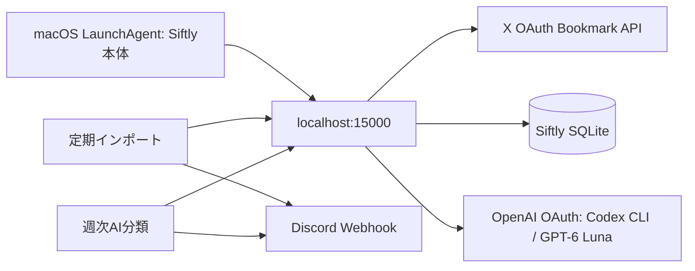

# Siftly 自動取り込み・週次AI分類 作業台帳

最終確認: 2026-09-26
この文書を、Siftlyの自動化作業で唯一の現行台帳として扱う。過去の設計案と食い違う場合は、この台帳の「現在の方針」と最新の作業記録を優先する。Lunaは一度に未完了IDを一つだけ実装し、完了条件を証拠付きで更新してから次へ進む。

初回は「現在の状態」と次のIDを読み、担当チケットに進む。Astraは計画・優先順位・台帳更新を担い、Lunaは指定された一つのコード作業を実装する。仕様選択が必要なら推測で埋めず、この台帳に論点と根拠を残してユーザーに尋ねる。

## 目的と現在の方針

- XのブックマークをSiftlyへ自動取得する。目安は3〜4日ごと。
- 保存済みの未分類ブックマークへ週1回AI分類をかけ、OpenAI OAuth経由のCodex CLIでGPT-6 Lunaを使う。分類要求のreasoning effortは`xhigh`。
- 実行結果をDiscord Webhookへ送る。
- 分類エンジンは`llm`を維持する。Jevは任意実装として残っているが、既定値を変えない。10件比較では自動採用0件で、切り替えの根拠がない。
- X APIの利用枠に達した記録がある。枠が戻ったことを確認するまで、Xへの実データ取得を試さない。

### 処理の流れ



## 状態の読み方

| 状態 | 意味 |
|---|---|
| 完了 | 実装または設定があり、この台帳に記した方法で現在の状態を確認した |
| 実装済み・未運用確認 | コードとテストはあるが、実アカウントでの実行・配信を確認していない |
| 要実装 | コード、設定、または検証が不足している |
| 外部待ち | Xの利用枠など、プロジェクト外の条件が整うまで実データで確認できない |
| 保留 | 今は不要。再開条件を記したもの |

「前回テストが通った」は、その時点の記録であり、今回この台帳作成時に全テストを再実行したという意味ではない。

## 現在の状態

| 項目 | 状態 | 根拠 |
|---|---|---|
| Siftly本体の起動 | **完了（ローカル設定）** | 以前のplistは配列で、LaunchAgentに必要な`Label`等を持たず、`plutil -lint`も失敗していた。2026-09-26に正しい辞書形式へ直し、`launchctl bootstrap gui/501 ...`で登録。`launchctl print gui/501/com.moemic.siftly`は`state = running`、`runs = 1`。`http://localhost:15000/settings`はHTTP 200で、設定画面にGPT-6 LunaとCodex CLIのサインイン状態を表示した。設定ファイルはこのMacの`~/Library/LaunchAgents/com.moemic.siftly.plist`にあり、Git管理外。 |
| X定期ジョブ | **実装済み・未運用確認** | `com.moemic.siftly.live-import`は3日間隔で登録済み。今回の確認では`runs = 0`。 |
| 週次分類ジョブ | **実装済み・未運用確認** | `com.moemic.siftly.ai-categorize`は7日間隔で登録済み。今回の確認では`runs = 0`。 |
| 自動ジョブの通知 | **送信経路あり・部分結果の判定要修正・未受信確認** | `.env`にWebhook設定があり、shellに送信処理がある。実行結果のDiscord受信は未確認。 |
| X API | **外部待ち** | 過去ログにX APIの403 `spend-cap-reached`がある。現在の利用枠は未確認。枠が回復するまで実取得を止める。 |
| AI分類 | **コード完了・実運用未確認** | `llm`が既定値。設定画面はOpenAI CLI/Codex CLIとGPT-6 Lunaを表示。Luna呼び出しに`reasoningEffort: 'xhigh'`を渡すコードとテストがある。最後に記録された全28テストファイル・220テスト、TypeScript、対象ESLintの合格は2026-09-23時点。 |
| Git | **前回まで完了** | HEAD `127a97f8c590123b1bbc181a255fda52f69d822f`（`Improve categorization retries and engine configuration`、2026-09-24）。今回のLaunchAgent修正はMac上のユーザー設定で、リポジトリのコミットには含まれない。 |

## Phase 0 — 実装前に再利用する契約

未完了チケットへ着手するLunaは、対象ファイルとそのテストを読み直す。下記は2026-09-26のコード確認で得た入口であり、実装前に現在のHEADと照合する。

### 使える既存API

- **X OAuth取り込み**: `POST /api/import/x-oauth/fetch`（`app/api/import/x-oauth/fetch/route.ts`）。入力に`maxPages`（1〜10）、`nextToken`、`includeThreads`、定期実行専用の`scheduled`がある。応答には`complete`、`hasMore`、安全な`warnings`を加えた。定期実行のカーソルはSQLite `Setting`の`x_oauth_scheduled_import_next_token`へページごとに保存する。
- **分類開始**: `POST /api/categorize`（`app/api/categorize/route.ts:109`）。通常は`{ force: false, language: 'ja' }`を送る。成功時は`{ status: 'started', total, runId }`を返す。
- **分類状態**: `GET /api/categorize`（同ファイル:77–88）。`status, runId, stage, done, total, stageCounts, lastError, error`を返す。`DELETE`は実行中の停止要求（同ファイル:91–103）。ジョブの監視は`runId`が開始時と同じであることを確認する。
- **通常分類の対象**: `POST /api/categorize`に`force:false`を渡す。現在は`enrichedAt`が未設定かつゴミ箱でないBookmarkを対象にする（同ファイル:258–265）。手動フィードバックを保護しながら保存する。
- **分類エンジン**: `getCategoryEngine()`（`lib/categorizer.ts:161–171`）。環境変数未設定時の既定値は`llm`。
- **分類結果保存**: `writeCategoryResults(results, options?)`（同ファイル:556–629）は保存されたBookmark IDの配列を返す。分類数はAI応答数ではなく、この保存結果を基準にする。
- **Codex CLI**: `codexPrompt(prompt, { model, reasoningEffort, timeoutMs })`（`lib/codex-cli.ts:36–56`）。コマンドは`CODEX_CLI_PATH`があればそれを使う。GPT-6 Lunaと`xhigh`を使う既存テスト例は`__tests__/categorizer-partial-response.test.ts:70`。
- **既存定期実行**: `scripts/siftly-scheduled-task.sh`がHTTP経由で取り込み・分類APIを呼び、分類は最大6時間ポーリングする。Webhook送信関数も同ファイル内にある。

### 避けること

- 別のX取得経路（Cookie/内部GraphQL）へ自動処理を切り替えない。希望しているのはSiftlyのX OAuthライブインポート。
- OpenAI OAuthをOpenAI SDKのAPIキーとして扱わない。OAuthは`codex exec`経由。
- X APIの403を一律に「月間上限」と推測しない。Xの応答に明示されたエラーだけ分類する。429と利用枠超過も混同しない。
- 既存の正常分類結果を、同じバッチの一部欠落だけを理由に破棄しない。欠落分の小分け再試行と部分結果保存は既に入っている。
- 通知失敗を理由にX取得やAI分類そのものをやり直さない。処理結果と通知の成否を分ける。
- `.env`、Webhook、OAuthトークン、ブックマーク本文をログやDiscordへ出さない。
- `start.sh`をLaunchAgentの起動先にしない。同スクリプトは依存導入、DBセットアップ、トンネル・ブラウザー操作も行う。LaunchAgentはNext.jsを直接起動する。

## Lunaが進める実装台帳

各IDを一度に一つだけ実装する。完了したら、変更ファイル、実行したコマンドと結果、残る制約、コミットをこの表へ記録する。テストではX・Codex・Discordの外部通信をモックし、実アカウントに接続しない。

### IMP-01 — X取り込みの部分失敗を成功と誤認しない

**状態: 完了（API契約・モック検証）。** 不正JSONは400。正常終端、ページ上限、途中のHTTP/通信/応答形式失敗を`complete`・`hasMore`・`warnings`で区別する。途中失敗はそのページのtokenを返し、成功済み件数を保持する。403はX応答に`spend-cap-reached`が明示された場合だけ`quota_exceeded`とする。空ページにtokenがあれば続行し、循環tokenでは現ページを保存してから停止する。

**変更範囲:** 取り込みrouteと`__tests__/x-oauth-fetch.test.ts`。HTTP/JSONの契約だけを最小限に直し、新しい汎用ジョブ基盤は追加しない。

**実装:**

1. 不正JSONは400にする。
2. 正常終端、ページ上限、途中失敗、認証失効を呼び出し側が区別できるようにする。既存の件数フィールドを維持し、必要なら`complete`と機械判定可能な`warnings`を追加する。
3. 途中失敗時は保存済み件数を返し、**失敗したページを再試行できるカーソル**を返す。HTTP 200だけで完全成功と判定させない。
4. `quota_exceeded`はX応答に明示があるときだけ返す。`Retry-After`は有効な数値等を解釈できた場合だけ時刻へ変換する。
5. 空データ＋`next_token`、無効応答、同一トークン再出現を正常終端と区別する。無限ループは止める。

**受け入れ条件:** 最初のページ429、1ページ保存後の2ページ目429、通信例外、正常な空終端、空ページ＋次トークン、トークン循環がそれぞれ別の結果になる。途中失敗は先に保存した件数を保持し、完了扱いにならない。JSON構文エラーのテストは400を確認する。既存の11ページ取得テストを維持する。

**実装記録:** 2026-09-26、Codex。`app/api/import/x-oauth/fetch/route.ts`、`__tests__/x-oauth-fetch.test.ts`を変更。`npx vitest run __tests__/x-oauth-fetch.test.ts` — 27 tests passed。`npx tsc --noEmit` — pass。対象ESLint — pass。実X通信なし。コミット: `97b2613`。

### IMP-02 — Xページングをプロセス再起動後も再開する

**状態: 完了（モック検証）。** 定期実行は既存SQLite `Setting`の`x_oauth_scheduled_import_next_token`を読み、ページ保存後に次tokenを記録する。最終ページでは空値にし、次回は先頭から開始する。失敗ページのtokenは直前の成功ページ保存時に記録済み。APIが保存tokenを無効と明示した場合はtokenを消し、次回の先頭再開を警告する。1回の起動は最大10ページ。

**変更範囲:** 既存routeとスケジューラーshell、既存テスト。状態は、既存SQLite/Settingを再利用するなど、コードベースの保存方式を確認してから一番小さい安全な場所へ置く。X OAuth token自体を新しい場所へ複製しない。

**実装:** 1回の起動で処理するページ数に上限を設け、ページごとの成功後にカーソルを保存する。部分失敗・プロセス停止後は失敗ページから再開する。最終ページまで完了したらカーソルを消し、次の定期実行は先頭から始める。再取得時の重複は`tweetId`で防ぐ。Xのページtokenが無効になった場合に、古いtokenでループせず新しい走査へ戻る条件を定義する。

**受け入れ条件:** 11ページ以上、プロセス停止と再起動、同じページの再試行、token失効、最終ページ後の新規走査をモックテストで確認。既存の重複回避を保ち、1回の起動で無制限にXを呼ばない。API quota中に実Xで試さない。

**実装記録:** 2026-09-26、Codex。既存`Setting`のみを再利用し、スキーマ変更なし。`scripts/siftly-scheduled-task.sh`は`scheduled:true`でrouteを呼ぶ。X API通信・ページtoken再開・token失効はすべてmock。`npx vitest run __tests__/x-oauth-fetch.test.ts` — 32 tests passed。`npx tsc --noEmit`、対象ESLint、`bash -n scripts/siftly-scheduled-task.sh` — pass。コミットは台帳へ追記する。

### IMP-03 — 自動取り込みでゴミ箱のBookmarkを復元しない

**状態: 要実装。** OAuth取り込みは既存Bookmarkを見つけると`deletedAt: null`へ戻す（`app/api/import/x-oauth/fetch/route.ts:344–351`）。自動定期実行でもユーザーが削除したデータが復元される。

**変更範囲:** 同じrouteと`__tests__/x-oauth-fetch.test.ts`。手動UIの現行動作との互換性を確認してから、呼び出しモードを明示する。Cookie同期や別の取得経路へ変更しない。

**受け入れ条件:** 自動モードの再取り込みでは`deletedAt`を保持し、同項目をarchive/thread処理へ再投入しない。既存の手動操作については既存仕様を保つか、明示された新仕様に合わせる。両モードのテストを置く。

**実装後の記録:** `未着手` → 実装者・日付・テスト結果・コミットを追記。

### CAT-01 — 停止要求後にLLMの追加要求を送らない

**状態: 要実装。** `categorizeBatch()`は`shouldAbort`を受け取るが、`llm`経路は`categorizeWithLlm()`へ渡さない（`lib/categorizer.ts:498–520`）。LLM応答の欠落分再試行も最大5件ずつ続く（同ファイル:13, 236–327）。`DELETE /api/categorize`は停止フラグを立てるだけで、既に動作中のCLI呼び出しを中断しない。

**変更範囲:** `lib/categorizer.ts`、必要な場合だけ`app/api/categorize/route.ts`、既存分類テスト。

**実装:** 新しいCLIプロセスを起動する前に停止フラグを確認する。進行中の要求は既存timeoutを尊重し、応答済みの有効結果は保持する。停止後に再試行バッチを起動しない。停止状態で返った結果を保存するかどうかは、データを失わない挙動を選びテストで固定する。

**受け入れ条件:** 最初のLLM要求中に停止を入れたテストで、追加retry/fallback要求が送られない。有効な既着結果を誤って破棄しない。通常時の5件以下の欠落retryと`xhigh`を維持する。

**実装後の記録:** `未着手` → 実装者・日付・テスト結果・コミットを追記。

### CAT-02 — 週次分類の件数と終了状態を保存結果にそろえる

**状態: 部分実装・追加確認が必要。** 選択分類経路は`writeCategoryResults()`の保存ID数を`categorized`へ加算する（`app/api/categorize/route.ts:170–202`）。通常の並列処理も保存ID数を使う（同ファイル:332–358）。ただし、0件や途中失敗の終端状態、各stage件数、停止との組み合わせをスケジューラー目線で確認するテストが足りるかは未確定。

**変更範囲:** まずrouteと既存テストを読み、再現する不整合がある場合だけ修正する。観測のために新しいDBモデルや実行履歴基盤を先回りして作らない。

**受け入れ条件:** 0件・全件成功・一部失敗・停止・別runIdへの切り替わりをモックテストで確認。`done`は処理済み数、`categorized`は実際に保存されたBookmark数として混同しない。既存件数をスケジューラーが正しく読める。

**実装後の記録:** `未着手` → 調査結果（修正不要なら根拠）・実装者・日付・テスト結果・コミットを追記。

### NOT-01 — Discordへ部分成功・失敗を正しく伝える

**状態: 要修正・未受信確認。** `scripts/siftly-scheduled-task.sh:43–56`にWebhook送信関数がある。importはHTTP成功ならレスポンス全文を通知するだけ（同ファイル:89–101）。分類はrunIdをポーリングし、エラー／成功を通知する（同ファイル:103–153）。importの部分失敗警告やページ継続を現在の応答から判断できない。

**変更範囲:** `scripts/siftly-scheduled-task.sh`と必要なshellテスト。IMP-01/02の応答契約に合わせて更新する。Webhook URL、token、生の投稿本文を通知に含めない。

**実装:** 完了・一部完了・利用枠/認証待ち・失敗を区別し、新規件数/既存件数/継続有無/安全なエラー要約を送る。継続中を完了と通知しない。空振り時に何を通知するかは「実行結果をDiscordへ」という依頼に沿い、少なくとも定期実行結果を分かる形で送る。通知に失敗しても元のimport/classifyを再実行しない。

**受け入れ条件:** shell構文検査とfake HTTP serverによる成功・部分成功・HTTP失敗・Webhook失敗の確認。Webhook失敗が検知され、X/分類APIが二重実行されない。通知本文に秘密値がない。実Webhook受信確認はQA-02で別に記録する。

**実装後の記録:** `未着手` → 実装者・日付・検証結果・コミットを追記。

### SCH-01 — 3〜4日ごとの取得と週次分類をスリープ後も実行する

**状態: 要実装・運用未確認。** 現在のLaunchAgentは`StartInterval` 259200秒と604800秒（各plist）で登録済み。macOSの`launchd.plist` man pageでは、スリープ中または前回処理中に発火した`StartInterval`はその回が失われると説明されている。今回の`launchctl print`では両ジョブとも`runs = 0`。週次分類とimportが同時刻になることも避けたい。

**変更範囲:** 2つのユーザーLaunchAgent plistと、必要な場合だけ既存shell。汎用scheduler/daemonは追加しない。

**実装案:** `StartCalendarInterval`でX取得を週2回（月曜・木曜、3日/4日の間隔）、分類を週1回（日曜）にする。時刻はJST 10:00を初期値としてよい（ユーザー指定は「いつでもよい」）。macOSがsleepを終えた後にcalendarイベントをまとめて実行する性質を使う。ジョブはユーザーがログイン中のLaunchAgentとして動かす。失敗中の連続起動や重複起動を避ける。

**受け入れ条件:** plistが辞書形式で`Label`、絶対パスの`ProgramArguments`、`WorkingDirectory`、ログ先を持つ。`plutil -lint`と`launchctl print`で2つの間隔/曜日、タイムゾーン前提、実行状態を確認する。設定反映のためbootstrapし直す前に、該当ジョブが処理中でないことを確認する。quota中にimportをkickstartしない。Siftly本体は今回修復済みの`com.moemic.siftly`を呼び出し先にする。

**実装後の記録:** `未着手` → 対象plist・曜日/時刻・状態・検証結果・コミット（リポジトリ外なら「ローカルのみ」）を追記。

### QA-01 — ローカル環境だけで3種類の結果経路を確認する

**状態: 要実施。** 本番のX/AI分類はまだ定期実行で確認していない。まず副作用をモックした小さな再現で実行スクリプトと結果判定を固める。

**受け入れ条件:**

1. import正常完了、部分成功、403/429失敗で通知結果が異なる。
2. 分類0件、完了、一部未分類、停止、6時間timeoutを区別する。
3. `runId`が変わった場合に別ジョブの完了と誤認しない。
4. Webhook障害時にX取得や分類を再実行しない。
5. fake server以外へ接続せず、DBの実ブックマークを変更しない。

### QA-02 — OAuth分類とDiscordの実運用を一度だけ確認する

**状態: 要実施。** ブラウザ設定はCodex CLIサインイン済み、GPT-6 Lunaを表示したが、LaunchAgent環境からの実分類要求とDiscordの受信は未確認。

**条件と手順:** QA-01完了後に実施する。最初に`/api/settings/cli-status`でCLIが利用可能と分かる範囲を確認する。小さい分類対象で通常分類を1回実行し、モデル・推論強度、保存数、run状態をログ/応答から確認する。次にDiscordへ結果が届いたことを確認する。秘密値・Bookmark本文をログに転記しない。X APIはこのQAで呼ばない。

**受け入れ条件:** Codex CLIの利用可能性、GPT-6 Lunaと`xhigh`、分類状態の正常終了、Discord受信を個別に記録。どれか一つでも未確認なら全体を「完了」にしない。

### QA-03 — Xの実取得と再開をquota回復後に確認する

**状態: 外部待ち。** 過去に403 `spend-cap-reached`を記録。最新の残枠・回復日時は不明で、今はX APIを呼ばない。

**受け入れ条件:** 利用枠回復後、最新のX status/usageを確認してから、通常モードで小さいページ上限の取得を1回行う。新規・重複・削除済み維持・途中失敗の通知を確認する。force取得や全件やり直しをしない。Xへの通信が許されないままなら、ローカルモック検証までを完了、実運用は外部待ちと記録する。

## 先送りする項目

- **Jevを既定にする**: 保留。現状の`SIFTLY_CATEGORY_ENGINE`既定値`llm`を維持する。十分な日本語ラベルで比較し、明確な精度向上と費用根拠が出たときだけ再検討する。
- **手動インポート画面のページ継続UI**: 自動ジョブの完了には不要。UIの`handleFetchBookmarks()`/`handleLiveSynced()`の継続token喪失は別のUX修正として扱う。
- **厳密なexactly-once通知や大規模なrun履歴DB**: 現段階では導入しない。重複Bookmark防止とログで足りない運用上の要件が見つかった場合に検討する。

## 完了の判定

次のすべてを証拠付きで確認した時点で、この自動化を完了にする。

- Siftly本体がログイン時に起動し、終了時は復帰し、localhost:15000/settingsが開く。
- 取得が3〜4日ごと、分類が週1回動き、スリープ復帰時に欠落を回収する。分類は保存済みの未分類投稿を処理する。
- 途中失敗/ページ継続/利用枠の状態を成功と誤認せず、再開できる。
- GPT-6 Luna、OpenAI Codex CLI OAuth、`xhigh`が実運用で確認できる。
- 実行結果がDiscordへ届き、Webhook障害で元処理を二重実行しない。
- X quota中に無用な実取得を繰り返さず、回復後の取得が重複やゴミ箱を壊さない。

## 用語

- **LaunchAgent**: macOSのユーザー単位で、ログイン中にアプリや定期処理を起動する仕組み。
- **pagination token / カーソル**: Xのページ取得を次の位置から再開する値。
- **runId**: 分類実行を識別する値。前の実行と別の状態を取り違えないために使う。
- **quota**: X APIで一定期間に利用できるリクエスト枠。

## 作業を始めるLunaへの指示

次に作業を再開するときは、まずこの台帳と対象ファイル・テストを読む。通常は未完了IDを一度に一つだけ実装し、関連テストと型検査を実行して記録してから次へ進む。ユーザーが台帳全体の完了を明示した場合は、この順序を守って次IDへ続けてよい。X quotaが回復するまでXへの実通信はしない。テストできない・受け入れ条件の選択が必要・既存実装が台帳と違う場合は、根拠を記録してそこで止める。

### 実装記録テンプレート

```text
ID:
状態: 要実装 / 作業中 / 完了 / 外部待ち / 保留
実施日・担当:
変更ファイル:
検証コマンドと結果:
手動/実運用確認:
未解決・制約:
コミット:
次のID:
```

## 参照

- [定期タスク初期設計（履歴）](2026-09-21-siftly-scheduled-tasks.md)
- [Jev分類設計と2026-09-23の比較結果（履歴）](2026-09-22-jev-categorization-design.md)
- `scripts/siftly-scheduled-task.sh`
- `app/api/import/x-oauth/fetch/route.ts`
- `app/api/categorize/route.ts`
- `lib/categorizer.ts`
- `lib/codex-cli.ts`
- `__tests__/x-oauth-fetch.test.ts`
- `__tests__/categorizer-partial-response.test.ts`
